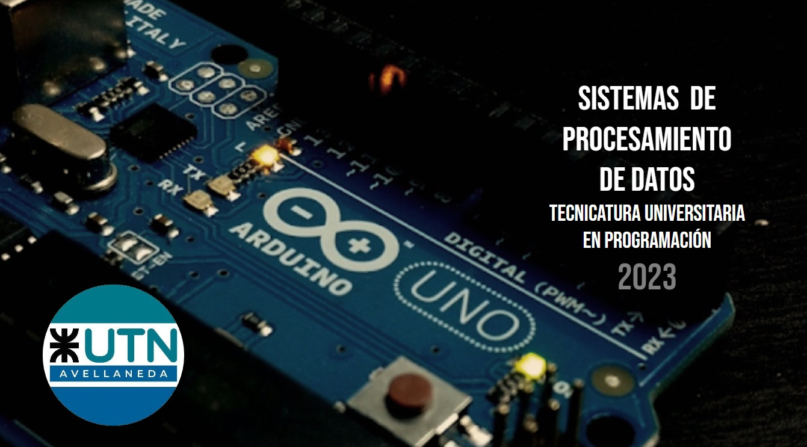
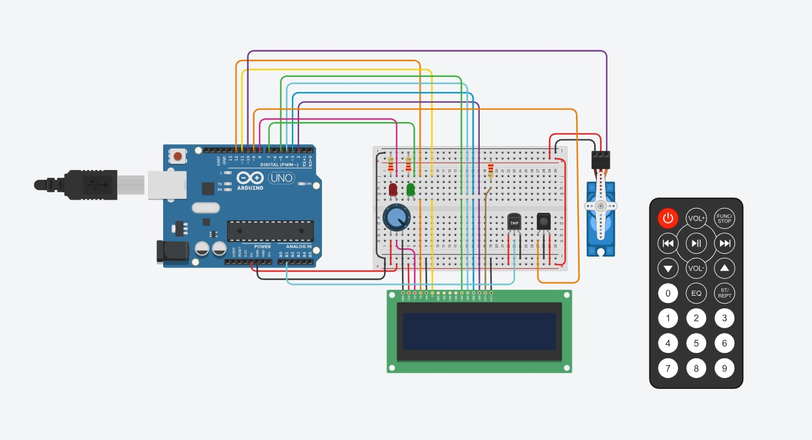
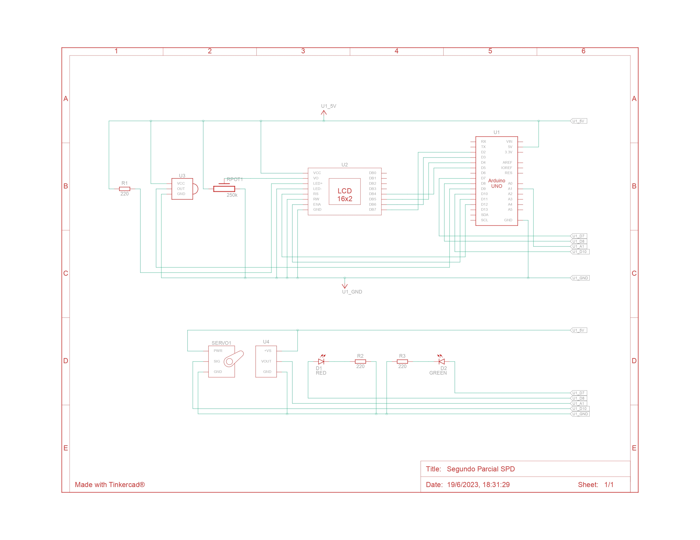

# Parcial-2-SPD
Segundo parcial SPD

# Sistema de procesamiento de datos 

## Integrantes 
- Eduardo Cruz

## Proyecto: Modelo de montacarga funcional.

## Descripción
El sistema de alarma se activa con el control remoto [IR Remote] y el sensor [IR Sensor] que es el encagado de leer las señales del control, con el Boton rojo (Tecla_on) enciende el LCD y con el boton 0 (Tecla_0) apaga el LCD.
Tiene 2 modos el sistemas de incendio, el modo uno[incendio] se activa con el boton 1 (Tecla_1) su funcion es solo modo incendio y
el modo dos[estacion_del_año] se activa con el boton 2 (Tecla_2) su funciones es sistemas de incendio mas el modo de 
temperatura actual y la estación del año en el display LCD.
En caso de aver incendio se activa el servo motor a una posicion de 180°.
Todo este comportamiento depende de la lectura del sensor de temperatura en el momento actual.
El led verde indica que esta prendido el el LCD y el rojo que esta apagado el LCD.

## Función principal
---
- Son define para el control remoto:
Tecla_ON
Tecla_0
Tecla_1
Tecla_2

- Son define para los pines de los led:
LED_ROJO 
LED_VERDE 
 

- El define para el sensor de temperatura:
SENSOR_TEMP 
 

/

//FUNCIONES

- alertaTemperatura();
Esta funcion lee constantemente la temperatura del sensor de temperatura y atraves de una condicion ejecuta
la impresion en el LCD -> "NO HAY INCENDIO" o "DETECCION INCENDIO".

- estacionDelAnio();
Esta funcion lee constantemente la temperatura del sensor de temperatura y atraves de una condicion ejecuta
la impresion en el LCD  idem a alertaTemperatura() , tambien muestra la estacion de año segun la temperatura leida
por el sensor de temperatura -> "PRIMAVERA" - "INVERNO" - "OTOÑO" - "VERANO".

- moverServo();
Esta funcion posiciona el servo segun el angulo pasado como parametro. 

- limpeza();
Esta funcion limpia la segunda fila  del LCD.

- imprecionLCD();
Esta funcion imprime en el LCD segun los parametros que les pasemos.
---

~~~ C (lenguaje en el que esta escrito)

//Eduardo Cruz
//Parcial 1

// C++ code

//LCD
#include <LiquidCrystal.h>
LiquidCrystal lcd_1(12, 11, 5, 4, 3, 2);

//CONTROL REMOTO
#include <IRremote.h>
#define Tecla_ON 0xFF00BF00 
#define Tecla_0 0xF30CBF00 

#define Tecla_1 0xEF10BF00  
#define Tecla_2 0xEE11BF00

int IR = 9;
// TECLAS AUXILIARES
#define Tecla_3 0xED12BF00  
#define Tecla_4 0xEB14BF00

//SERVOS
#include <Servo.h>
Servo Servo1;

//LCD
int seconds = 0;
char* txt;

//PIN SERVOS
int servoPin = 10;

//LEDS
#define LED_ROJO 8
#define LED_VERDE 7

//SENSOR DE TEMPERATURA
#define SENSOR_TEMP A1
float temperatura = 0;

//ESTADOS
bool stateIncendio = false;
bool stateEstacion = false;

//-----------FIRMA DE FUNCIONES----------

void moverServo(int grados);
void alertaTemperatura(float temp);
void estacionDelAnio(float temp);
void imprecionLCD(float temp,char* estacion);

// ---------------PROGRAMA-------------------

void setup()
{
  //CONTROL REMOTO
  IrReceiver.begin(IR, DISABLE_LED_FEEDBACK);  
  //LCD: Configure el número de columnas y filas en la pantalla LCD.
  lcd_1.begin(16, 2);  
  //SERVO
  Servo1.attach(servoPin);
  //SENSOR DE TEMPERATURA
  pinMode(SENSOR_TEMP, INPUT);
  //LEDS
  pinMode(LED_ROJO, OUTPUT); 
  pinMode(LED_VERDE, OUTPUT);
  //SERIAL
  Serial.begin(9600);
  
}
 
void loop()
{
  //SENSOR DE TEMPERATURA
  temperatura = map(analogRead(SENSOR_TEMP),0,1023,-50,450);

  //lcd_1.blink();
 
  //CONTROL REMOTO
  if (IrReceiver.decode()) {   
    switch(IrReceiver.decodedIRData.decodedRawData ){

      case Tecla_ON:
      lcd_1.display();	
      digitalWrite(LED_VERDE,1);
      digitalWrite(LED_ROJO,0);
      break;

      case Tecla_0:
      lcd_1.noDisplay();
      digitalWrite(LED_VERDE,0);
      digitalWrite(LED_ROJO,1); 
      break;
      
      case Tecla_1:
      stateIncendio = !stateIncendio;  
      stateEstacion = false; 
      break;
      
      case Tecla_2:
      stateEstacion = !stateEstacion; 
      stateIncendio = false; 
      break;
    }

    IrReceiver.resume(); 

  }
  
  //-------------ESTADOS------------
  
  if(stateIncendio == true){
    alertaTemperatura(temperatura);
  }
 
   if(stateEstacion == true){
    estacionDelAnio(temperatura);
  }
 

}//FIN LOOP

//-------------------FUNCIONES------------------

//CAMBIA EL ANGULO DEL SERVO
void moverServo(int grados){
  Servo1.write(grados);
} 

//ALERTA SENSOR
void alertaTemperatura(float temp){
  
  if(temp < 60){
    lcd_1.setCursor(0,0);  
    lcd_1.print("NO HAY INCENDIO");
    lcd_1.setCursor(0,1);
    lcd_1.print(temp);
    //MUEVO SERVO
    moverServo(0);
    
    }
  
  if(temp > 60){
    lcd_1.setCursor(0,0);
    lcd_1.print("DETECCION INCENDIO");
    lcd_1.setCursor(0,1);
    lcd_1.print(temp);
    //MUEVO SERVO
    moverServo(180);
  }

}

// MUESTRA LA ESTACION DEL AÑO DEPENDIENOD EL CLIMA LEIDO Y SIST. INCENDIO
void estacionDelAnio(float temp){
  
  if(temp > 25 && temp < 40){
    limpeza();
     imprecionLCD(temp,"     VERANO     ");
    moverServo(0);
    delay(100);
  }
  
  if(temp > 15 && temp < 25){
    limpeza();
    imprecionLCD(temp,"     OTOÑO     ");
    moverServo(0);
    delay(100);
  }
  
  if(temp > 10 && temp < 15){
    limpeza();
    imprecionLCD(temp,"   PRIMAVERA   ");
    moverServo(0);
    delay(100);
  }
  
  if( temp < 10){
    limpeza();
    imprecionLCD(temp,"    INVERNO     ");
    moverServo(0);
    delay(100);
  }
  
   if( temp > 40 && temp < 60){
     limpeza();
     imprecionLCD(temp,"EXESO DE CALOR  ");
     moverServo(0);
     delay(100);
  }
  
   if(temp > 60){
    lcd_1.setCursor(0,0);
    lcd_1.print("DETECCION INCENDIO");
    lcd_1.setCursor(0,1);
    lcd_1.print(temp);
    //MUEVO SERVO
    moverServo(180);
  }
  
}

// LIMPIA LA 2DA FILA DEL LCD
void limpeza(){
    lcd_1.setCursor(0,1);
    lcd_1.print("                 ");
}

// IMPRIME EN EL LCD
void imprecionLCD(float temp,char* estacion){
  
    lcd_1.setCursor(0,0);
    lcd_1.print(estacion);
    lcd_1.setCursor(0,1);
    lcd_1.print(temp);
}
  
~~~

## :robot: Link al proyecto
- [proyecto](https://www.tinkercad.com/things/4d9ElHX5RU1-segundo-parcial-spd/editel?sharecode=kUeYwDXTdoViBw1gcjDPGlrzVPOM39eIm3lnjkr_GPQ)

---
### Diagrama esquemático del circuito

- Led Verde, Led Rojo : Prende la luz avisando si esta prendido o no el sistema de incendio.

- Resistencia : En el proyecto todas tienen el valor de 220 Ω (ohms), 
                modificar el paso de la corriente para el perfecto funcionamiento de cada componente.

- Sensor de temperatura : Lee la temperatura ambiente actual, con la funcion map() hacemos 
                          la convercion grados celcius.

- LCD : Su funcion es mostrar  que esta sucediendo en ese momento utilizando la reprentacion de 
        numeros y letras a traves del display.

- IR Remote : Permite mandar una señal con diferntes codigos, que seran leidos por el IR Sensor para poder realizar una
             accion en el circuito.

- IR Sensor : Permite leer las señales emitidas por el IR Remote 

- Potenciometro : Regula el contraste de la pantalla del LCD.

---

